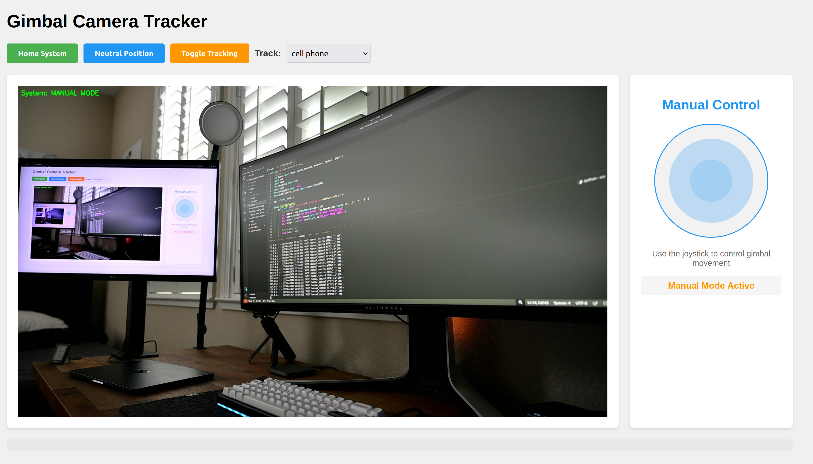

# Sentry Camera Object Tracker

**Web Interface**:



## To run Flask app:
```bash
python app.py
```
- **Web interface is @ localhost:5000**

**Linux Bug**:
Temp fix for "global cap_v4l.cpp:1119 tryIoctl VIDEOIO(V4L2:/dev/video0): select() timeout" error:
```bash
sudo rmmod uvcvideo && sudo modprobe uvcvideo nodrop=1 timeout=5000
```
- This needs to be ran every time before a script is ran that uses the camera.

**Version 4**:


**Version 3**:


**Version 2.2**:


**Version 2**:


**Version 1 (Servo Motors)**:

