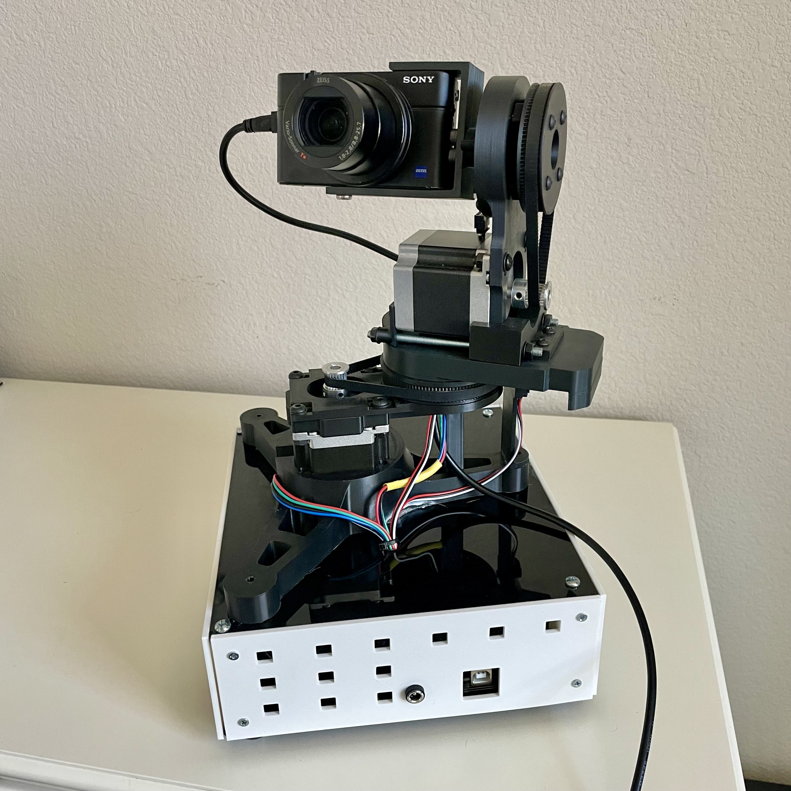
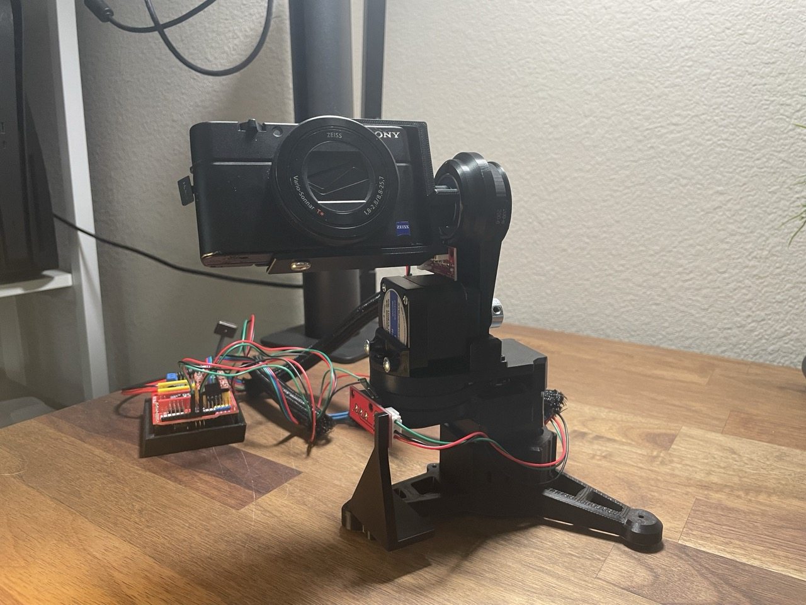
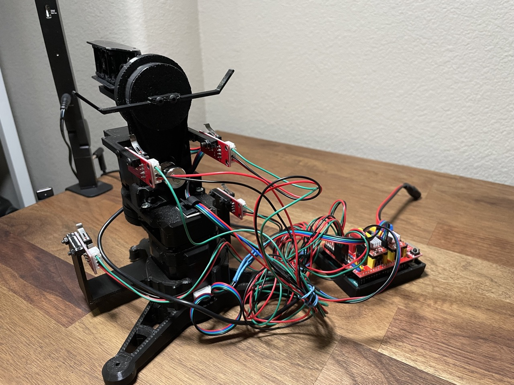
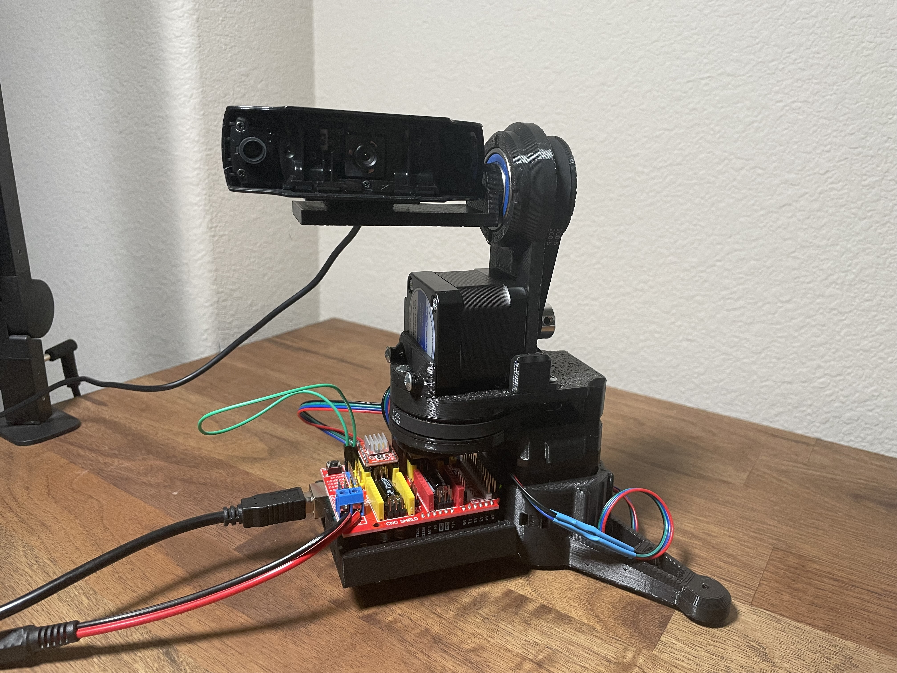
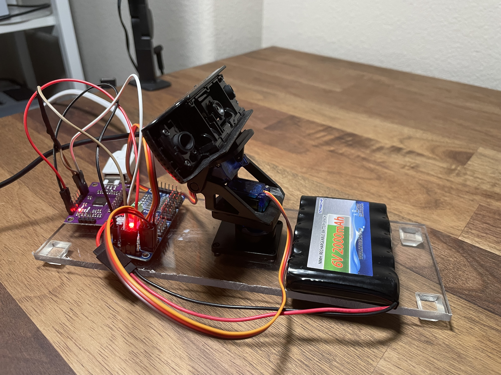

# Sentry Camera Object Tracker

## Instructions:

*Note: VISCA commands only work with the contour motion detection method.*

**If using contour motion detection:**
- Change L#24 for using the VISCA command protocol. 
    - SERIAL = True # Serial connection via Arduino
    - SERIAL = False # VISCA PTZ Camera
```bash
python3 main_contours.py
```

**If using Yolov8 object detection:**
```bash
python3 main_yolo.py
```

**Linux Bug**:
Temp fix for "global cap_v4l.cpp:1119 tryIoctl VIDEOIO(V4L2:/dev/video0): select() timeout" error:
```bash
sudo rmmod uvcvideo && sudo modprobe uvcvideo nodrop=1 timeout=5000
```
- This needs to be ran every time before a script is ran that uses the camera.

**Version 5**:



**Version 4**:


**Version 3**:



**Version 2.2**:



**Version 2**:



**Version 1 (Servo Motors)**:

