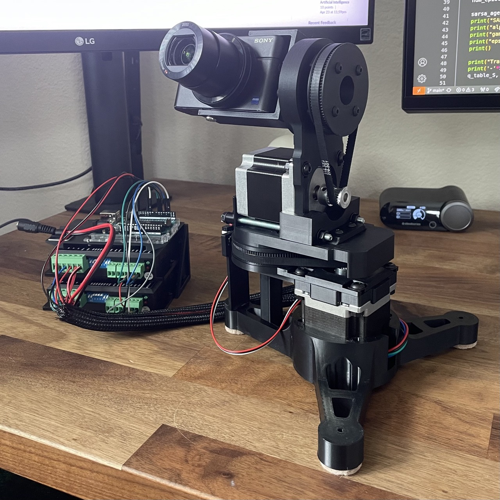

# Sentry Camera Object Tracker

Instructions:
- In main.py, change line #26 for using the VISCA command protocol. 
    - SERIAL = True # Serial connection via arduino
    - SERIAL = False # VISCA PTZ Camera

Project Contents:
- archive: old code
- images: images for README.md
- src: main functions
- stepper_serial_control: Arduino code for stepper motor control
- tests: for camera, motion detection, Yolov8 object identification

**Linux Bug**:
Temp fix for "global cap_v4l.cpp:1119 tryIoctl VIDEOIO(V4L2:/dev/video0): select() timeout" error:
```bash
sudo rmmod uvcvideo && sudo modprobe uvcvideo nodrop=1 timeout=5000
```

**Version 4**:




**Version 3**:


**Version 2.2**:


**Version 2**:


**Version (Servo Motors) 1**:

