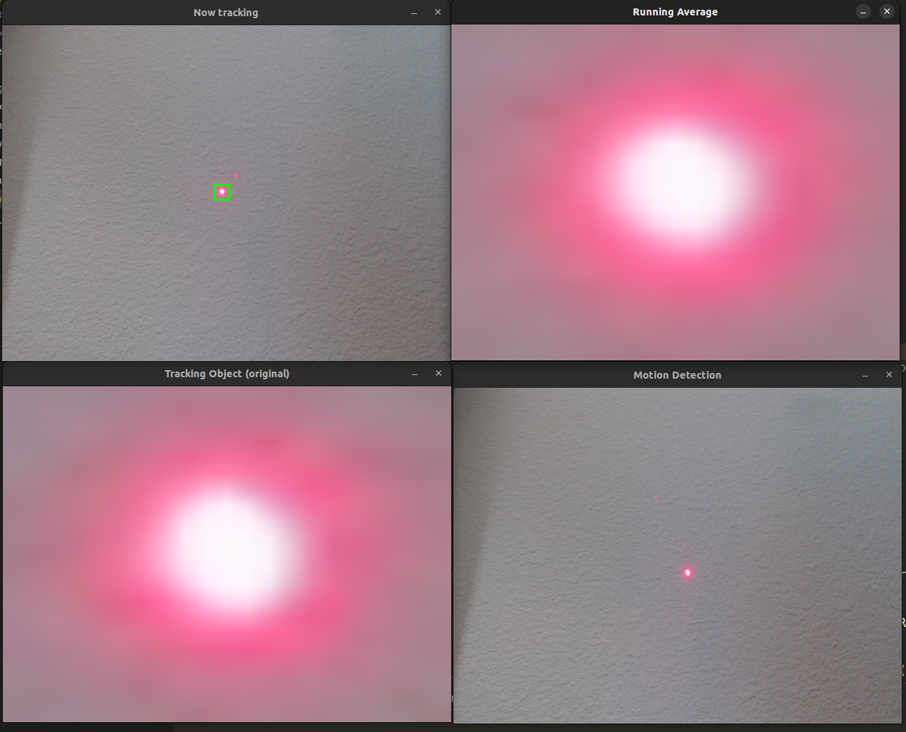
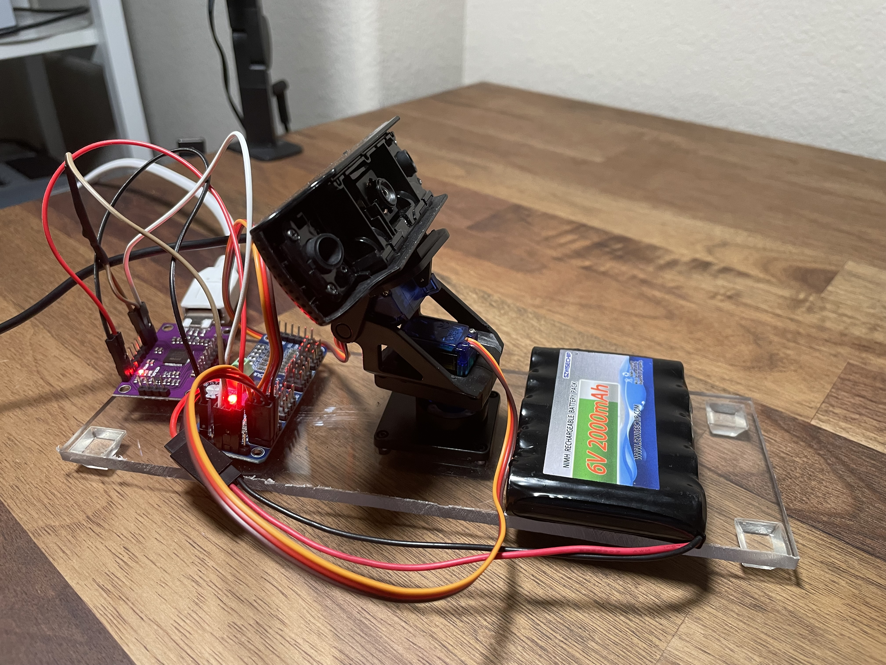

# Sentry Camera Object Tracker

Project Contents:
- archive: old code
- images: images for README.md and PyTorch timing test
- src: main functions
- stepper_serial_control: Arduino code for stepper motor control
- tests: for webcam, servo, motion detection, FT232H/PCA9685 control boards, cpu vs gpu comparison

Needed if using FT232H/PCA9685 controller:
```bash
export BLINKA_FT232H='1'
```

Temp fix for "global cap_v4l.cpp:1119 tryIoctl VIDEOIO(V4L2:/dev/video0): select() timeout" error:
```bash
sudo rmmmod uvcvideo
sudo modprobe uvcvideo nodrop=1 timeout=5000
```
(possible other fix):
```bash
export OPENCV_VIDEOIO_PRIORITY_MSMF=0
```

Screen View:



**v1**:



**v2**:


---
## Template Matching Speed Test

**AMD Ryzen 9 7950X 16/32 vs. Nvidia 4090**

Full: 6000 x 4000 pixels

Crop: 151 x 144 pixels

```
python tests/cpu_vs_gpu.py
```

OUTPUT:
```
OpenCV (CPU):
Location: (3180, 3174)
Time: 0.495360 seconds

PyTorch (GPU):
Location: ([3808], [987])
Time: 0.037448 seconds
```